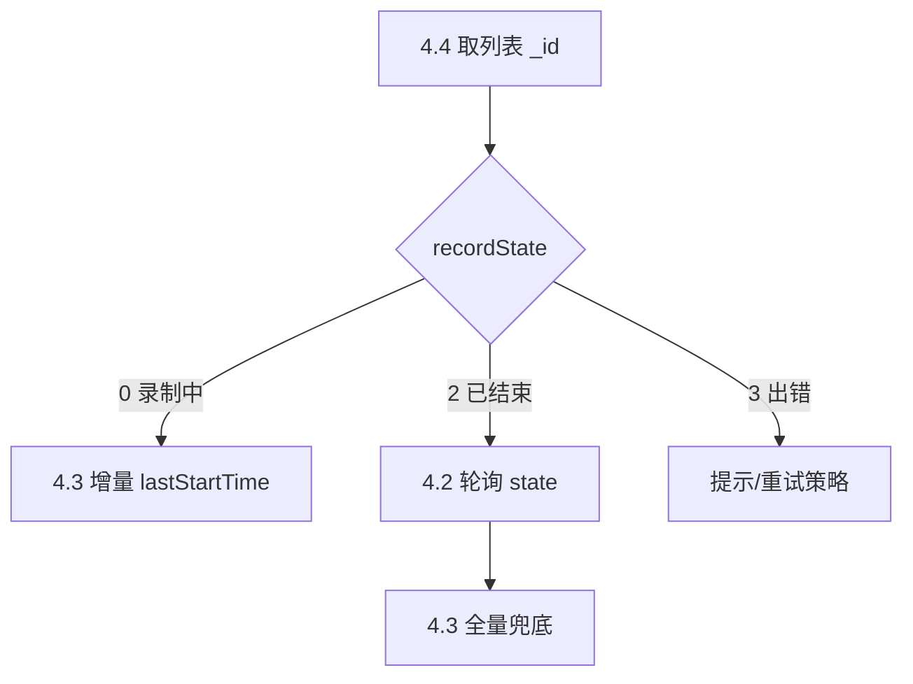

# AI慧记 Open API 接口文档

## 修订记录

| 版本 | 日期 | 变更摘要 | 变更人 |
|------|------|----------|--------|
| 1.0 | 2026-03-25 | 初版创建 | 成伟 |
| 1.1 | 2026-03-27 | 新增「增量查询分片录音转写列表」「按视频会议号查询慧记列表」能力（**当前文档编号为 4.3、4.4**） | - |
| 1.2 | 2026-03-28 | 补充相关业务流程说明；明确 **4.1**（本人名下）与 **4.4**（参与会议 + 会议号）口径差异 | - |
| 1.3 | 2026-03-31 | 删除已废弃接口，重新编号接口列表；完善公共数据结构 | - |
| 1.4 | 2026-04-10 | 新增 **4.7** 通过文件URL创建慧记接口说明（`startChatByFileUrl`） | - |
| 1.5 | 2026-04-16 | 合并原 1.5/1.6 变更：统一示例与 `recordState` 口径；补充 4.2 示例字段、完善 4.4 `lastTs`/时间戳与错误码/失败示例；概述与通用说明补全；业务流程改为 3.1～3.6；第四章接口分组；第五章公共数据结构集中；新增最佳实践、FAQ、接口调用示例与注意事项分类 | doc-editor |

> 说明：早期修订记录中的小节编号若与当前第四章不一致，以**当前第四章与「一、概述」表格**为准；历史条目不再改写编号，仅在 1.1/1.2 中注明与现编号的对应关系。

## 变更日志（摘要）

以下为与对接相关的**主要版本摘要**（完整条目见上方 **修订记录** 表）。

### v1.5（2026-04-16）

- **一致性修复**：统一示例与 `recordState` 口径；补充 4.2 示例字段；完善 4.4 `lastTs` / 时间戳示例；补充错误码与通用响应失败示例；各接口补充「数据量级别」「AI决策」列。
- **结构**：业务流程调整为 **3.1～3.6**；第四章增加**接口分组索引**；**五、公共数据结构**集中收录各 VO；**注意事项**按类别重组（见 **十、注意事项**）。
- **内容**：通用说明补充**环境/超时/限流占位**、**安全与权限**、**参考文档**；新增 **最佳实践**、**FAQ**、**端到端调用示例**；错误码补充常见 HTTP 语义码（以实际网关为准）。

### v1.4（2026-04-10）

- 新增 **4.7** 通过文件 URL 创建慧记。

---

## 一、概述

### 1.1 文档定位与能力范围

**AI慧记**面向会议与语音场景，提供慧记列表查询、录音分片转写拉取、会后改写状态查询、视频会议维度关联查询、分享与通过音频 URL 创建慧记等能力。本文档描述 **open-api** 网关暴露的 **AI慧记** HTTP 接口契约，供业务系统与自动化集成（含 AI Skill）使用。

- **适用场景**：个人「我的慧记」检索、视频会议纪要对齐、转写原文与改写终稿展示、分享传播、离线音频文件入库生成慧记等。
- **核心能力**：分页列表、增量/全量分片转写、改写状态轮询、按会议号拉取、分享创建与解析、文件 URL 创建慧记。
- **详细接口定义**：以下「快速索引」仅列路径与章节锚点，**字段级说明以第四章与第五章为准**。

### 1.2 快速索引（接口清单）

全部接口均为 **`POST`**，完整 URL 为 `https://{域名}/open-api` 加上表中「接口路径」；域名与超时等见 **二、通用说明**。

| 序号 | 能力简述 | 文档小节 | 接口路径（相对 `/open-api`） |
|------|----------------|----------|------------------------------|
| 1 | 查询我的AI慧记列表（本人名下） | 4.1 | `/ai-huiji/meetingChat/chatListByPage` |
| 2 | 查询转写状态与改写原文 | 4.2 | `/ai-huiji/meetingChat/checkSecondSttV2` |
| 3 | 增量查询指定慧记的分片录音转写列表 | 4.3 | `/ai-huiji/meetingChat/splitRecordListV2` |
| 4 | 按视频会议号查询慧记列表（参与关系，含他人录制本人参会） | 4.4 | `/ai-huiji/meetingChat/listHuiJiIdsByMeetingNumberV2` |
| 5 | 根据慧记Id创建慧记分享信息 | 4.5 | `/ai-huiji/meetingChat/createShareV2` |
| 6 | 根据慧记分享ID查询慧记信息 | 4.6 | `/ai-huiji/meetingChat/getChatFromShareId` |
| 7 | 通过文件URL创建慧记（上传音频V2） | 4.7 | `/ai-huiji/meetingChat/startChatByFileUrl` |

---

## 二、通用说明

### 2.1 访问地址

```
https://{域名}/open-api/{接口地址}
```

### 2.2 环境信息

| 环境   | 域名/Base URL                    | 备注 |
| ------ | ------------------------------- | ---- |
| 生产环境 | `https://sg-al-cwork-web.mediportal.com.cn`      | 网关/前端入口域名，**实际 open-api 域名以部署为准** |
| 测试 / 预发 | *由运维或项目组提供* | 联调前请向管理员索取 Base URL 与白名单 |

**客户端建议**

- **超时**：单次 HTTP 调用建议 **≥ 30s**（转写列表、大分片场景可能较慢）；轮询类调用可略短并配合重试策略。
- **限流**：开放平台可能按 `appKey` 限流；若返回 **429** 或业务提示「频繁」，请**退避重试**（见 **六、错误码说明** 与 **七、最佳实践**）。具体 QPS/配额以**现网策略**或**开放平台管理员**为准。

### 2.3 公共请求头

| Header         | 说明                                    | 是否必填 |
| -------------- | --------------------------------------- | -------- |
| `appKey`       | 应用密钥，请联系管理员获取                  | 是       |
| `Content-Type` | 固定为 `application/json`（所有接口均为 POST） | 是       |

### 2.4 通用响应结构

所有接口返回统一的 `Result<T>` 结构：

```json
{
   "resultCode": 1,
   "resultMsg": null,
   "data": null
}
```

| 字段         | 类型    | 说明                                  |
| ------------ | ------- | ------------------------------------- |
| `resultCode` | Integer | 业务状态码，`1` 表示成功，其他值表示失败。常见取值见 **六、错误码说明** |
| `resultMsg`  | String  | 提示信息，成功时多为 `null`，失败时为可读错误描述，便于排查 |
| `data`       | T       | 业务数据，不同接口类型不同；**失败时通常为 `null`** |

**失败响应示例**：

```json
{
   "resultCode": 0,
   "resultMsg": "参数错误: meetingChatId不能为空",
   "data": null
}
```

### 2.5 接口状态（稳定性）

当前文档所列接口均为**正式对外能力**，默认视为**稳定可用**；若后续新增「测试版 / 废弃」接口，将在对应小节 **基本信息** 中单独标注，并同步 **变更日志**。

### 2.6 安全与权限

- 所有请求须使用 **HTTPS**（生产环境）。
- **`appKey` 由管理员分配**，须妥善保管，**禁止**写入前端公开仓库或客户端硬编码；泄露后应立即轮换。
- 接口返回的慧记内容可能含敏感信息，请按公司数据分级与权限规范使用。

### 2.7 参考文档

| 文档 | 说明 |
| ---- | ---- |
| [《基础服务》文件服务 4.3 获取七牛上传 Token](https://github.com/xgjk/dev-guide/blob/main/02.%E4%BA%A7%E5%93%81%E4%B8%9A%E5%8A%A1AI%E6%96%87%E6%A1%A3/%E5%9F%BA%E7%A1%80%E6%9C%8D%E5%8A%A1/API%E6%8E%A5%E5%8F%A3%E6%98%8E%E7%BB%86/02-%E6%96%87%E4%BB%B6%E6%9C%8D%E5%8A%A1.md#43-%E8%8E%B7%E5%8F%96%E4%B8%83%E7%89%9B%E4%B8%8A%E4%BC%A0-token) | 七牛上传凭证（与 **4.7** 前置上传示例一致） |
| [七牛 Python SDK](https://developer.qiniu.com/kodo/1242/python) | 七牛官方 Python 上传说明 |

### 2.8 限流与配额

- **限流**：按 `appKey`、IP 或网关策略限制 QPS；超限常见返回 **`429`** 或业务文案提示「频繁」，处理见 **六、错误码说明** 与 **七、最佳实践**。
- **配额**：单日调用量、创建慧记条数等**以开放平台或项目组公布为准**；联调前请向管理员确认。

---

## 三、关键业务流程说明

> 下列 **3.1～3.6** 与第四章接口对应关系：**3.1～3.2/3.3** 主要用 **4.1**、**4.3**、**4.2**；**3.4** 用 **4.4**；**3.5** 用 **4.5**、**4.6**；**3.6** 用 **4.7**。技术细节与参数以第四章为准，本章仅保留**可执行步骤**。

### 3.1 查询我的会议纪要列表

分页拉取「我的会议纪要」，区分进行中与已结束；入口为 **4.1**。

1. 调用 **4.1**，传入 `pageSize`、`pageNum`、`chatTypeList` 等，获取 `total` 与 `pageContent`。
2. 列表项展示字段：`name`、`createTime`、`finishTime`、`recordState` 等；**`recordState`** 含义见 **五、5.1 FindChatVO**（**`0`** 录制中，**`2`** 已结束，**`3`** 处理出错）。

### 3.2 实时获取会议转写（会中）

会中展示转写流：先取得 `meetingChatId`（**4.1** 或 **4.4** 列表项 `_id`，且 **`recordState = 0`** 表示录制中），再调用 **4.3** 并传入 **`lastStartTime`** 做增量拉取，定期请求以获取新分片。

### 3.3 获取会议完整原文与改写终稿（会后）

**会后原文**：对已结束慧记（**`recordState = 2`**），**4.3** 不传 `lastStartTime` 可拉全量分片原文。  
**改写终稿**：对同一 `meetingChatId` 使用 **4.2** 轮询整体 **`state`**；成功（`2`）后以改写内容为准；若长时间处理中或失败，可暂用 **4.3** 全量分片拼接兜底（见 **4.2** 提示、**七、最佳实践**）。

### 3.4 按视频会议号查询慧记（与「我的」列表口径差异）

围绕**视频会议号**拉取当前用户参与的会议慧记，用 **4.4**（`meetingNumber`，可选 `lastTs`）。**与 4.1 的差异**：**4.1** 为「我名下」归属；**4.4** 为「我参与该会议」即使他人录制也可查。  
取得列表后按 **`recordState`** 分流：录制中 → **4.3 增量**；已结束 → **4.2 + 4.3 兜底**；出错 → 业务提示。

**完整路由（视频会议维度）**

1. **4.4** 取列表，`_id` → `meetingChatId`。
2. **`recordState = 0`**：走 **3.2**（**4.3 增量**）。  
3. **`recordState = 2`**：走 **3.3**（**4.2** 优先，**4.3** 兜底）。  
4. **`recordState = 3`**：提示错误，勿按正常转写链路继续。

### 3.5 慧记分享流程

1. **4.5** 传入 `meetingChatId`，获取 `shareId`、`url` 等。  
2. 将分享链接或 `shareId` 交给下游；打开方调用 **4.6** 传入 `shareId` 拉取慧记摘要信息。

### 3.6 通过文件 URL 创建慧记

1. 将音频文件上传至**七牛指定 Bucket**（见 **基础服务 4.3** 与 **4.7** 前置说明与 Python 示例）。  
2. 调用 **4.7**，传入公网可访问的 `fileUrl` 与 `fileExt`。  
3. 返回的 `_id` 作为 `meetingChatId` 继续 **4.2 / 4.3**。

**路由示意（视频会议 3.4，与 4.4 列表配合）**



---

## 四、接口详细说明

### 接口分组索引

| 分组 | 接口编号 | 说明 |
| ---- | -------- | ---- |
| **查询类** | **4.1**～**4.4** | 我的列表、改写状态、分片转写列表、按会议号列表 |
| **分享类** | **4.5**～**4.6** | 创建分享、按分享 ID 查慧记 |
| **创建类** | **4.7** | 通过文件 URL 创建慧记 |

字段级定义、示例与 **AI决策** 列见各小节；**公共数据结构**统一见 **五、公共数据结构**。

---

### 4.1 查询我的AI慧记列表

按条件分页查询**归属当前用户名下**的 AI 慧记列表（「我的」慧记），通常作为获取 `meetingChatId` 的入口接口。

**与 4.4 的差异**：本接口以慧记**归属者**为口径（「我的」慧记）。若需按**视频会议号 + 参会关系**拉取（含他人录制、本人参会），见 **4.4** 与 **三、3.4** 的对比说明。

**基本信息**

| 项目         | 说明                                    |
| ------------ | --------------------------------------- |
| 接口地址     | `/ai-huiji/meetingChat/chatListByPage` |
| 请求方式     | `POST`                                  |
| Content-Type | `application/json`                      |
| 数据量级别   | 中（分页列表；单页体积随 `pageSize` 增长，典型约 1–10KB 量级） |
| 默认返回条数 | 由请求体 `pageSize` 决定（示例为 10） |
| 最大返回条数 | 以服务端限制为准；建议 `pageSize` ≤ 200 |
| 预估响应体积 | 约 2–5 KB / 20 条（示意，随字段多少变化） |

**请求参数**

请求体为 JSON，字段如下：

| 参数名         | 类型            | 必填 | 说明                                                                                                                                                                                        |
| -------------- | --------------- | ---- |-------------------------------------------------------------------------------------------------------------------------------------------------------------------------------------------|
| `pageSize`     | Integer         | 是   | 每页数量                                                                                                                                                                                      |
| `pageNum`      | Integer         | 是   | 页码（从 0 开始）                                                                                                                                                                                |
| `chatTypeList` | List\<Integer\> | 否   | 慧记类型列表，与代码 `ChatListByPageParam` 一致。可传类型：`0` 玄关会议、`1` 用户上传音频、`2` 提交文字、`3` 上传文本文件、`4` 文件列表、`5` 录音实时转写、`6` 上传文件不总结、`7` ai慧记、`8` 上传音频V2、`9` 慧记玄关会议、`10` 外部产生慧记(合规等)、`11` 钉钉闪记。 以上类型均表示生成慧记方式 |
| `nameBlur`     | String          | 否   | 名称模糊搜索                                                                                                                                                                                    |
| `sortKey`      | String          | 否   | 排序字段，默认 `updateTime`                                                                                                                                                                      | 

**请求示例**

```bash
curl 'https://{域名}/open-api/ai-huiji/meetingChat/chatListByPage' \
  -H 'appKey: XXXXXXXX' \
  -H 'Content-Type: application/json' \
  -d '{
    "pageSize": 10,
    "pageNum": 0,
    "chatTypeList": [7]
  }'
```

**响应参数**

`data` 类型为 `MeetingChatPageVO`，字段定义见 **五、5.2 MeetingChatPageVO**。下表为带 **AI决策** 的摘录：

| 字段名        | 类型                  | AI决策 | 说明               |
| ------------- | --------------------- | --- | ------------------ |
| `total`       | Long                  | 是   | 总记录数            |
| `pageContent` | List\<FindChatVO\>    | 是   | 分页内容列表，元素结构见 **五、5.1 FindChatVO** |

> **AI决策**：调用方（含 AI Skill）是否必须依赖该字段以完成当前任务；**是** 表示强依赖，**否** 表示可选展示或辅助信息。

**响应示例**

```json
{
   "resultCode": 1,
   "resultMsg": null,
   "data": {
      "total": 50,
      "pageContent": [
         {
            "_id": "664f1a2b3c4d5e6f7a8b9c0d",
            "name": "产品周会（录制中）",
            "recordState": 0,
            "createTime": 1716345600000,
            "finishTime": null,
            "meetingLength": null,
            "simpleSummary": null
         },
         {
            "_id": "774f1a2b3c4d5e6f7a8b9c0e",
            "name": "上周复盘（已结束）",
            "recordState": 2,
            "createTime": 1715740800000,
            "finishTime": 1715745300000,
            "meetingLength": 2700000,
            "simpleSummary": "示例摘要"
         }
      ]
   }
}
```

#### 数据流向

- 列表项中的 `name`、`createTime`、`finishTime`、`recordState` 等可直接用于 UI；其中 **`recordState`**：`0`=录制中，`2`=结束，`3`=处理出错（见 **五、5.1 FindChatVO**）。
- 返回的 `pageContent[*]._id` 可作为需传入 **`meetingChatId`** 的接口（**4.2 / 4.3 / 4.5**）的入参（**4.6** 使用 `shareId`，不适用；调用前注意 **十、注意事项** 中 `_id` 带 `__` 后缀时的处理）。


### 4.2 查询指定慧记的转写状态与改写原文

查询指定慧记音频转文字的处理状态、进度及改写文字内容。是否已转写完成请以整体 **`state`** 字段为准（与 `FindChatVO.recordState` 不同语义；**`state` 为改写/二次转写整体状态**，见下表）。JSON 字段名 **`state`** 与后端 `CheckSecondSttV2VO` 一致。


**基本信息**

| 项目         | 说明                                      |
| ------------ | ----------------------------------------- |
| 接口地址     | `/ai-huiji/meetingChat/checkSecondSttV2` |
| 请求方式     | `POST`                                    |
| Content-Type | `application/json`                        |
| 数据量级别   | 小（单条状态查询，响应体积通常不足 1KB） |
| 默认返回条数 | 固定单条 `data` |
| 最大返回条数 | 固定单条 `data` |
| 预估响应体积 | 通常不足 1KB（随 `sttPartList` 长度变化） |

**请求参数**

| 参数名           | 类型   | 必填 | 说明    |
| ---------------- | ------ | ---- |-------|
| `meetingChatId`  | String | 是   | 慧记 ID |

**请求示例**

```bash
curl 'https://{域名}/open-api/ai-huiji/meetingChat/checkSecondSttV2' \
  -H 'appKey: XXXXXXXX' \
  -H 'Content-Type: application/json' \
  -d '{
    "meetingChatId": "664f1a2b3c4d5e6f7a8b9c0d"
  }'
```

**响应参数**

`data` 类型为 `CheckSecondSttV2VO`，完整字段定义见 **五、5.3 CheckSecondSttV2VO**。下表为带 **AI决策** 的摘录：

| 字段名          | 类型                         | AI决策 | 说明 |
| --------------- | ---------------------------- | --- | ---- |
| `totalProgress` | Long                         | 是   | 改写进度 |
| `state`         | Integer                      | 是   | 改写整体状态：`1`=进行中，`2`=成功，`3`=失败 |
| `sttPartList`   | List\<SttPartItem\>          | 是   | 文字改写分片列表；元素类型为内部类 `SttPartItem`，见下表 |
| `errMsg`        | String                       | 否   | 改写错误信息 |

`SttPartItem`（`CheckSecondSttV2VO.SttPartItem`）字段：

| 字段名         | 类型   | AI决策 | 说明            |
| -------------- | ------ | --- |---------------|
| `speakerName`  | String | 否   | 发言人           |
| `rewriteText`  | String | 是   | 改写后的文本        |
| `startTime`    | Long   | 否   | 分片开始对应的慧记录制时间 |
| `rewriteState` | Integer | 否   | 分片改写状态：`1`=进行中，`2`=成功，`3`=失败 |

**响应示例**

```json
{
   "resultCode": 1,
   "resultMsg": null,
   "data": {
      "totalProgress": 100,
      "state": 2,
      "sttPartList": [
         {
            "speakerName": "张三",
            "rewriteText": "改写后的段落内容……",
            "startTime": 120000,
            "rewriteState": 2
         }
      ],
      "errMsg": null
   }
}
```

> 提示：该接口返回的是**当前时刻**的转写状态快照。若业务侧需要更准确地感知“是否已完成转写”，建议基于 `meetingChatId` 按固定间隔（如 2~5 秒）轮询调用本接口，并以 `state`（整体状态）作为完成判断依据；当状态为成功（`2`）后即可停止轮询。

#### 数据流向

- 入参 `meetingChatId` 通常来自 **4.1 / 4.4** 列表项 `_id`。
- 返回的 `state` / `totalProgress` / `sttPartList` 用于判断改写是否完成；与 **4.3** 分片原文配合：改写未完成时可先用 **4.3** 全量/增量兜底展示原文。

---

### 4.3 查询慧记的分片录音转写列表

查询进行中、已完成慧记的录音原文内容，按照录音分片结构返回。
请求体支持可选字段 **`lastStartTime`**：不传或者值小于0，表示查询全量内容； 其它返回所有startTime > lastStartTime 的分片原文内容。

调用方需要根据拉取到的总列表按照startTime顺序排列获得最大的startTime作为下一次调用接口时lastStartTime值，从而实现增量查询。

**基本信息**

| 项目         | 说明                                      |
| ------------ | ----------------------------------------- |
| 接口地址     | `/ai-huiji/meetingChat/splitRecordListV2` |
| 请求方式     | `POST`                                    |
| Content-Type | `application/json`                        |
| 数据量级别   | 大（分片多时可较大；建议增量 + `lastStartTime`，避免单次全量过大） |
| 默认返回条数 | 不固定（随会议时长与分片数量变化） |
| 最大返回条数 | 以服务端为准；长会议请优先增量 |
| 预估响应体积 | 随分片数量线性增长，大会议可能达到数百 KB 级（示意） |

**请求参数**

| 参数名           | 类型   | 必填 | 说明 |
| ---------------- | ------ | ---- | ---- |
| `meetingChatId`  | String | 是   | 慧记 ID |
| `lastStartTime`  | Long   | 否   | 上次已同步的最大 `startTime`（与分片上 `startTime` 同语义，相对录音起点的毫秒）。**不传**：返回全量；**传**：仅返回 `startTime` 大于该值的记录（`startTime` 为 `null` 的分片在增量模式下会被过滤掉） |

**请求示例（全量）**

```bash
curl 'https://{域名}/open-api/ai-huiji/meetingChat/splitRecordListV2' \
  -H 'appKey: XXXXXXXX' \
  -H 'Content-Type: application/json' \
  -d '{
    "meetingChatId": "664f1a2b3c4d5e6f7a8b9c0d"
  }'
```

**请求示例（增量）**

```bash
curl 'https://{域名}/open-api/ai-huiji/meetingChat/splitRecordListV2' \
  -H 'appKey: XXXXXXXX' \
  -H 'Content-Type: application/json' \
  -d '{
    "meetingChatId": "664f1a2b3c4d5e6f7a8b9c0d",
    "lastStartTime": 120000
  }'
```

**响应参数**

`data` 类型为 `List<SplitRecordVO>`，元素定义见 **五、5.4 SplitRecordVO**。下表为带 **AI决策** 的摘录：

| 字段名      | 类型   | AI决策 | 说明 |
| ----------- | ------ | --- | ---- |
| `text`      | String | 是   | 转写文本（会议原文片段）。 |
| `realTime`  | Long   | 否   | 现实时间戳（毫秒），用于排序与时间段筛选。 |
| `startTime` | Long   | 是   | 开始时间（相对录音起点的毫秒数），用于排序、增量与时间段筛选。 |

**响应示例**

```json
{
   "resultCode": 1,
   "resultMsg": null,
   "data": [
      {
         "realTime": 1774613847119,
         "startTime": 120000,
         "text": "片段会议原文..."
      }
   ]
}
```

#### 数据流向

- 入参 `meetingChatId` 通常来自 **4.1 / 4.4** 列表项 `_id`。
- 返回的 `SplitRecordVO` 列表一般可按 `startTime` 升序排列后拼接为完整录音原文；**增量模式**下，将本次返回中的最大 `startTime` 作为下次调用的 `lastStartTime`，实现增量同步。
- 与 **4.2** 配合：会中实时展示以 **4.3 增量**为主；会后终稿/改写是否完成以 **4.2** 的 `state` 为准，**4.3** 可作原文兜底。

---

### 4.4 按视频会议号查询慧记列表

根据 **视频会议号**（业务侧会议编号），查询**当前用户在该场会议参与关系下**可访问的慧记记录列表。

**与 4.1 的差异**：口径说明与路由示例见 **三、3.4**；本接口侧重「**会议号 + 我是否参会**」，**4.1** 侧重「**慧记归属在我名下**」，二者不可替代。

**基本信息**

| 项目         | 说明                                               |
| ------------ | -------------------------------------------------- |
| 接口地址     | `/ai-huiji/meetingChat/listHuiJiIdsByMeetingNumberV2` |
| 请求方式     | `POST`                                             |
| Content-Type | `application/json`                                 |
| 数据量级别   | 中（列表；建议单次拉取控制在百条以内，视业务而定） |
| 默认返回条数 | 不固定（由服务端与筛选条件决定） |
| 最大返回条数 | 建议不超过 100 条（示意；以服务端为准） |
| 预估响应体积 | 随列表长度变化，典型约数 KB 至数十 KB |

**请求参数**

请求体为 JSON，字段如下：

| 参数名           | 类型   | 必填 | 说明                                                                  |
| ---------------- | ------ | ---- |---------------------------------------------------------------------|
| `meetingNumber`  | String | 是   | 视频会议号（业务约定格式，与会议域一致）                                                |
| `lastTs`         | Long   | 否   | 时间戳（增量，**毫秒**）。**未传或为 `0`**：只拉取**最近一个月**的记录；**大于 `0`**：拉取时间戳**大于** `lastTs` 的数据，用于增量同步。请勿传入负数（无业务含义） |

**请求示例**

```bash
curl 'https://{域名}/open-api/ai-huiji/meetingChat/listHuiJiIdsByMeetingNumberV2' \
  -H 'appKey: XXXXXXXX' \
  -H 'Content-Type: application/json' \
  -d '{
    "meetingNumber": "MTG-20260327-001",
    "lastTs": 0
  }'
```

**响应参数**

| 字段名 | 类型 | AI决策 | 说明 |
| ------ | ---- | --- | ---- |
| `data` | List\<FindChatVO\> | 是 | 慧记列表；元素字段见 **五、5.1 FindChatVO**（本接口由会议域组装的字段可能少于 **4.1** 全量列表，以实际返回为准） |

**响应示例**

```json
{
   "resultCode": 1,
   "resultMsg": null,
   "data": [
      {
         "_id": "37644c5a-5ddd-48f1-b473-75098924d7a0",
         "name": "周例会",
         "recordState": 2,
         "createTime": 1716345600000,
         "finishTime": 1716349200000,
         "meetingLength": 3600000,
         "personId": null
      }
   ]
}
```

#### 数据流向

- 列表项 `_id` 作为 **`meetingChatId`** 用于 **4.2 / 4.3 / 4.5** 等接口。
- 结合 **`recordState`** 与会中/会后分支，参见 **3.4**。

### 4.5 根据慧记Id创建慧记分享信息

为指定慧记创建分享，返回分享码、分享 ID、链接等信息；下游与 `createShareV2` 一致。创建成功后可将返回的 **`shareId`** 用于 **4.6 根据慧记分享ID查询慧记信息**。

**基本信息**

| 项目         | 说明                                      |
| ------------ | ----------------------------------------- |
| 接口地址     | `/ai-huiji/meetingChat/createShareV2`     |
| 请求方式     | `POST`                                    |
| Content-Type | `application/json`                        |
| 数据量级别   | 小（单条分享信息，通常不足 2KB） |
| 默认返回条数 | 固定单条 `data` |
| 最大返回条数 | 固定单条 `data` |
| 预估响应体积 | 通常不足 2KB |

**请求参数**

请求体为 JSON，与 `MeetingChatIdParam` 一致：

| 参数名           | 类型   | 必填 | 说明    |
| ---------------- | ------ | ---- | ------- |
| `meetingChatId`  | String | 是   | 慧记 ID |

**请求示例**

```bash
curl 'https://{域名}/open-api/ai-huiji/meetingChat/createShareV2' \
  -H 'appKey: XXXXXXXX' \
  -H 'Content-Type: application/json' \
  -d '{
    "meetingChatId": "664f1a2b3c4d5e6f7a8b9c0d"
  }'
```

**响应参数**

`data` 类型为 `CreateShareV2VO`，完整定义见 **五、5.5 CreateShareV2VO**。下表为带 **AI决策** 的摘录：

| 字段名      | 类型   | AI决策 | 说明     |
| ----------- | ------ | --- | -------- |
| `code`      | String | 否   | 分享码   |
| `title`     | String | 否   | 标题     |
| `shareId`   | String | 是   | 分享 ID  |
| `url`       | String | 是   | 分享链接 |
| `shortUrl`  | String | 否   | 短链接   |
| `desc`      | String | 否   | 描述     |
| `imgUrl`    | String | 否   | 图片链接 |

**响应示例**

```json
{
   "resultCode": 1,
   "resultMsg": null,
   "data": {
      "code": "ABC123",
      "title": "产品周会",
      "shareId": "83780c2a-572f-4c3f-a964-d542f2a1372c",
      "url": "https://example.com/share/...",
      "shortUrl": "https://s.example.com/xxxxx"
   }
}
```

#### 数据流向

- 入参 `meetingChatId` 来自 **4.1 / 4.4** 等列表项 `_id`。
- 返回的 `shareId` 用于 **4.6** 的 `shareId` 入参。

---

### 4.6 根据慧记分享ID查询慧记信息

根据慧记分享 ID 查询（或通过分享复制）慧记会议信息，通常用于「他人通过分享链接打开慧记」或业务侧根据分享码查询慧记详情。分享 ID 可由 **4.5** 创建分享接口返回。

**基本信息**

| 项目         | 说明                                           |
| ------------ | ---------------------------------------------- |
| 接口地址     | `/ai-huiji/meetingChat/getChatFromShareId`    |
| 请求方式     | `POST`                                        |
| Content-Type | `application/json`                            |
| 数据量级别   | 小（单条慧记摘要信息，通常不足 5KB） |
| 默认返回条数 | 固定单条 `data` |
| 最大返回条数 | 固定单条 `data` |
| 预估响应体积 | 通常数 KB 以内（随 `srcText` 长度变化） |

**请求参数**

请求体为 JSON，字段如下：

| 参数名      | 类型   | 必填 | 说明         |
| ----------- | ------ | ---- | ------------ |
| `shareId`   | String | 是   | 慧记分享 ID  |

**请求示例**

```bash
curl 'https://{域名}/open-api/ai-huiji/meetingChat/getChatFromShareId' \
  -H 'appKey: XXXXXXXX' \
  -H 'Content-Type: application/json' \
  -d '{
    "shareId": "83780c2a-572f-4c3f-a964-d542f2a1372c"
  }'
```

**响应参数**

`data` 类型为 `ChatShareIdVO`，完整定义见 **五、5.6 ChatShareIdVO**（多余字段可能由后端扩展）。下表为带 **AI决策** 的摘录：

| 字段名             | 类型                  | AI决策 | 说明                  |
| ------------------ | --------------------- | --- | --------------------- |
| `_id`              | String                | 是   | 慧记 ID               |
| `chatType`         | Integer               | 否   | 聊天类型               |
| `createTime`       | Long                  | 否   | 创建时间（毫秒）        |
| `meetingLength`    | Long                  | 否   | 会议时长（毫秒）        |
| `name`             | String                | 是   | 会议名称               |
| `simpleSummary`    | String                | 是   | 简要摘要               |
| `srcText`          | String                | 是   | 原始文本               |
| `srcUser`          | Object                | 否   | 分享来源用户信息；常见子字段：`_id`（用户 ID）、`name`（用户名称） |
| `updateTime`       | Long                  | 否   | 更新时间（毫秒）        |

**响应示例**

```json
{
   "resultCode": 1,
   "resultMsg": null,
   "data": {
      "_id": "664f1a2b3c4d5e6f7a8b9c0d",
      "chatType": 7,
      "createTime": 1716345600000,
      "meetingLength": 3600000,
      "name": "产品周会（分享副本）",
      "simpleSummary": "本次会议讨论了Q2产品路线图...",
      "srcText": "大家好，今天我们主要讨论...",
      "srcUser": {
         "_id": "user_001",
         "name": "张三"
      },
      "updateTime": 1716349200000
   }
}
```

#### 数据流向

- 入参 `shareId` 来自 **4.5** 返回的 `shareId` 或分享链接解析结果。
- 返回的 `_id` 可作为后续 **4.2 / 4.3** 等接口的 `meetingChatId`（与列表接口口径一致）。

---

### 4.7 通过文件URL创建慧记

通过可访问的音频文件 URL 发起慧记创建。

> 前置说明（重要）：当前慧记服务仅支持七牛云服务指定 Bucket 空间下的文件地址，暂不支持其他文件服务器地址。请严格按照下面Python SDK 上传示例流程，先将文件上传至七牛后，再将生成的公网访问 URL 作为 `fileUrl` 传入本接口。

**基本信息**

| 项目         | 说明                                           |
| ------------ | ---------------------------------------------- |
| 接口地址     | `/ai-huiji/meetingChat/startChatByFileUrl`    |
| 请求方式     | `POST`                                        |
| Content-Type | `application/json`                            |
| 数据量级别   | 小（单条创建结果，通常不足 2KB） |
| 默认返回条数 | 固定单条 `data` |
| 最大返回条数 | 固定单条 `data` |
| 预估响应体积 | 通常不足 2KB |

**请求参数**

请求体为 JSON，字段如下（与 `StartChatByFileUrlParam` 一致）：

| 参数名      | 类型    | 必填 | 说明 |
| ----------- | ------- | ---- | ---- |
| `fileUrl`   | String  | 是   | 音频/视频文件可访问 URL。 |
| `fileExt`   | String  | 是   | 文件扩展名（不含点，内部会规范化）。当前支持：`mp3`、`mp4`、`wav`、`m4a`。 |

> 文件URL建议：推荐先将文件上传到七牛，拿到可公网访问的 URL（例如 `https://...`）后，再将该地址作为 `fileUrl` 传入本接口。获取七牛上传 token 的接口请参考 [《基础服务-> API接口明细-> 文件服务 4.3章节》](https://github.com/xgjk/dev-guide/blob/main/02.%E4%BA%A7%E5%93%81%E4%B8%9A%E5%8A%A1AI%E6%96%87%E6%A1%A3/%E5%9F%BA%E7%A1%80%E6%9C%8D%E5%8A%A1/API%E6%8E%A5%E5%8F%A3%E6%98%8E%E7%BB%86/02-%E6%96%87%E4%BB%B6%E6%9C%8D%E5%8A%A1.md#43-%E8%8E%B7%E5%8F%96%E4%B8%83%E7%89%9B%E4%B8%8A%E4%BC%A0-token)。

**Python SDK 上传示例（`put_file_v2`）**

```python
# pip install qiniu requests
import os
import uuid
import requests
from qiniu import put_file_v2

# 步骤一：调用《基础服务-> API接口明细-> 文件服务 4.3章节》接口获取 token
# GET /open-api/cwork-file/getUploadToken/cwork
base_url = "https://{域名}/open-api"
app_key = "YOUR_APP_KEY"

token_resp = requests.get(
    f"{base_url}/cwork-file/getUploadToken/cwork",
    headers={"appKey": app_key},
    timeout=10
)
token_resp.raise_for_status()
token_json = token_resp.json()
if "data" not in token_json or "token" not in token_json.get("data", {}):
    raise ValueError(f"获取上传Token失败: {token_json}")
token = token_json["data"]["token"]

# 步骤二：准备本地音频文件与 key（建议：UUID + 文件后缀）
localfile = r"D:\audio\demo.wav"
file_ext = os.path.splitext(localfile)[1]   # 例如 .wav
key = f"{uuid.uuid4()}{file_ext}"

# 步骤三：调用七牛 Python SDK 上传文件
ret, info = put_file_v2(token, key, localfile, version="v2")
print("ret:", ret)
print("info:", info)

# 步骤四：拼接可访问文件 URL（空间外链域名 + key）
# <空间外链域名> 需替换为七牛空间绑定的外链域名（非上传接口返回的 upload host），可向运维或文件服务管理员索取。
# 示例：filegpt-hn.file.mediportal.com.cn
# file_url = f"https://filegpt-hn.file.mediportal.com.cn/{key}"
file_url = f"https://<空间外链域名>/{key}"
print("fileUrl:", file_url)
```


**请求示例**

```bash
curl 'https://{域名}/open-api/ai-huiji/meetingChat/startChatByFileUrl' \
  -H 'appKey: XXXXXXXX' \
  -H 'Content-Type: application/json' \
  -d '{
    "fileUrl": "https://filegpt-hn.file.mediportal.com.cn/21ccb6c1-6500-46f8-a4ff-d26deb73c36c语音035.m4a",
    "fileExt": "m4a"
  }'
```

**响应参数**

`data` 类型为 `StartChatResultVO`，完整定义见 **五、5.7 StartChatResultVO**。下表为常用字段摘录（含 **AI决策**）：

| 字段名       | 类型    | AI决策 | 说明 |
| ------------ | ------- | --- | ---- |
| `_id`        | String  | 是   | 慧记 ID。 |
| `chatType`   | Integer | 否   | 慧记类型。 |
| `recordState`| Integer | 是   | 当前处理状态（`0` 录制中，`2` 结束，`3` 处理出错）。 |
| `fileUrl`    | String  | 是   | 文件 URL。 |
| `fileExt`    | String  | 否   | 文件扩展名。 |
| `name`       | String  | 是   | 慧记名称。 |
| `createTime` | Long    | 否   | 创建时间（毫秒）。 |
| `updateTime` | Long    | 否   | 更新时间（毫秒）。 |
| `personId`   | String  | 否   | 人员 ID。 |
| `userId`     | String  | 否   | 用户 ID。 |

**响应示例**

```json
{
   "resultCode": 1,
   "resultMsg": null,
   "data": {
      "_id": "e6839164-2491-4fb3-899a-c27fedb82a68",
      "chatType": 8,
      "recordState": 2,
      "fileUrl": "https://filegpt-hn.file.mediportal.com.cn/21ccb6c1-6500-46f8-a4ff-d26deb73c36c语音035.m4a",
      "fileExt": "m4a",
      "name": "2026-04-10 11:17:13 记录",
      "createTime": 1775791033252,
      "updateTime": 1775791033252,
      "personId": "12028",
      "userId": "1742024210481586177"
   }
}
```

#### 数据流向

- 入参 `fileUrl` / `fileExt` 由七牛上传成功后拼出的公网 URL 与扩展名组成（见上文 Python 示例）。
- 返回的 `_id` 可作为 **`meetingChatId`** 用于 **4.2 / 4.3** 等接口。

## 五、公共数据结构

> 本章集中列出各接口 `data` 中使用的 **VO** 定义，与代码包 `com.xgjktech.openapi.feign.aihuiji.vo` 对齐。第四章各节「响应参数」为便于阅读保留了**摘录表**；字段冲突时以**本章为准**。

### 5.1 FindChatVO（4.1 / 4.4 列表元素）

**4.1** 分页项与 **4.4** 列表项均为本结构（**4.4** 可能仅填充部分字段）。

| 字段名          | 类型                   | 说明 |
| --------------- | ---------------------- | ---- |
| `_id`           | String                 | 会议 ID（即 `meetingChatId`）。 |
| `name`          | String                 | 会议名称。 |
| `recordState`   | Integer                | 录音状态。本文档与 Open API 约定：**`0`** 录制中，**`2`** 已结束，**`3`** 处理出错。源码 `FindChatVO` 中 `@ApiModelProperty` 曾出现 `1` 表示结束，**若实际 JSON 与本文不一致，以联调返回值为准**。 |
| `combineState`  | Integer                | 文件合并状态：`0` 进行中，`2` 已完成（若下游返回）。 |
| `createTime`    | Long                   | 创建时间（毫秒时间戳）。 |
| `finishTime`    | Long                   | 完成时间（毫秒时间戳）。 |
| `meetingLength` | Long                   | 会议时长（毫秒）。**可能为空**，例如慧记未结束或会议仍进行中。 |
| `tidyText`      | String                 | 整理后正文摘要；可能为空。 |
| `simpleSummary` | String                 | 简单摘要（`tidyText` 为空时兜底）；可能为空。 |
| `keywordList`   | List\<KeywordItem\>    | 关键词列表；可能为空。 |
| `personId`      | String                 | 拥有者标识（内部用）；可能为空。 |

`KeywordItem`：`keyword`（String）。

---

### 5.2 MeetingChatPageVO（4.1）

| 字段名        | 类型               | 说明 |
| ------------- | ------------------ | ---- |
| `total`       | Long               | 总记录数。 |
| `pageContent` | List\<FindChatVO\> | 当前页数据列表。 |

---

### 5.3 CheckSecondSttV2VO（4.2）

| 字段名          | 类型                | 说明 |
| --------------- | ------------------- | ---- |
| `totalProgress` | Long                | 改写进度。 |
| `state`         | Integer             | 改写整体状态：`1` 进行中，`2` 成功，`3` 失败（JSON 字段名 **`state`**，与后端一致）。 |
| `sttPartList`   | List\<SttPartItem\> | 改写分片列表。 |
| `errMsg`        | String              | 错误信息。 |

**SttPartItem**

| 字段名         | 类型    | 说明 |
| -------------- | ------- | ---- |
| `speakerName`  | String  | 发言人。 |
| `rewriteText`  | String  | 改写后的文本。 |
| `startTime`    | Long    | 分片开始对应的慧记录制时间。 |
| `rewriteState` | Integer | 分片改写状态：`1` 进行中，`2` 成功，`3` 失败。 |

---

### 5.4 SplitRecordVO（4.3）

| 字段名      | 类型   | 说明 |
| ----------- | ------ | ---- |
| `text`      | String | 转写文本（会议原文片段）。 |
| `realTime`  | Long   | 现实时间戳（毫秒），用于排序与筛选。 |
| `startTime` | Long   | 相对录音起点的毫秒数，用于排序与增量。 |

---

### 5.5 CreateShareV2VO（4.5）

| 字段名     | 类型   | 说明   |
| ---------- | ------ | ------ |
| `code`     | String | 分享码 |
| `title`    | String | 标题   |
| `shareId`  | String | 分享 ID |
| `url`      | String | 分享链接 |
| `shortUrl` | String | 短链接 |
| `desc`     | String | 描述   |
| `imgUrl`   | String | 图片链接 |

---

### 5.6 ChatShareIdVO（4.6）

`ChatShareIdVO` 可忽略未知字段（`@JsonIgnoreProperties(ignoreUnknown = true)`）。

| 字段名          | 类型    | 说明 |
| --------------- | ------- | ---- |
| `_id`           | String  | 慧记 ID。 |
| `chatType`      | Integer | 聊天类型。 |
| `createTime`    | Long    | 创建时间（毫秒）。 |
| `meetingLength` | Long    | 会议时长（毫秒）。 |
| `name`          | String  | 会议名称。 |
| `simpleSummary` | String  | 简要摘要。 |
| `srcText`       | String  | 来源文本。 |
| `srcUser`       | SrcUser | 分享来源用户；子字段 `_id`、`name`。 |
| `updateTime`    | Long    | 更新时间（毫秒）。 |

---

### 5.7 StartChatResultVO（4.7）

| 字段名           | 类型    | 说明 |
| ---------------- | ------- | ---- |
| `_id`            | String  | 慧记 ID。 |
| `chatType`       | Integer | 慧记类型。 |
| `createTime`     | Long    | 创建时间（毫秒）。 |
| `updateTime`     | Long    | 更新时间（毫秒）。 |
| `recordState`    | Integer | 与慧记 `recordState` 语义一致（见 **5.1**）。 |
| `fileUrl`        | String  | 文件 URL。 |
| `fileExt`        | String  | 文件扩展名。 |
| `name`           | String  | 会议名称。 |
| `personId`       | String  | 人员 ID。 |
| `userId`         | String  | 用户 ID。 |

---

## 六、错误码说明

开放平台网关或上游服务可能返回以下典型 `resultCode` / HTTP 语义（**以实际响应为准**；与《开放平台》统一错误码文档冲突时，以现网为准）。

| resultCode | 说明 | AI处理动作 |
| ---------- | ---- | ---------- |
| `1` | 请求成功 | 读取 `data` |
| `0` | 通用失败 | 读取 `resultMsg`；记录日志 |
| `400` | 参数错误（请求体非法、缺字段等） | 对照第四章修正请求；**勿盲目重试** |
| `401` | 鉴权失败（`appKey` 无效或未携带） | **停止重试**，检查密钥与请求头 |
| `403` | 权限不足（无权访问该慧记/资源） | 提示用户；联系管理员开通权限 |
| `404` | 资源不存在（如 `meetingChatId` 无效） | 核对 ID 来源与 **十、注意事项** 中 `_id` 规则 |
| `429` | 请求过于频繁（限流） | **等待约 5 秒后重试**，建议最多 3 次并退避 |
| `500` | 系统异常 / 服务内部错误 | **稍后重试**，建议最多 3 次；仍失败则转人工或工单 |

> 说明：部分环境可能将 **HTTP 状态码** 与 **`resultCode`** 组合返回，或将鉴权/限流统一映射为 `0` 与文案；请以 **`resultMsg`** 与现场联调结果为准。

---

## 七、最佳实践

1. **轮询（4.2）**：间隔 **2～5 秒**；整体 `state = 2` 或 `3` 时停止；设最大总时长与超时提示。
2. **分页（4.1）**：`pageSize` 建议 **10～50**；单页过大增加响应体积与解析成本。
3. **增量（4.3）**：会中场景务必维护 **`lastStartTime`**（最大 `startTime`）；长会议避免依赖单次全量。
4. **4.4 `lastTs`**：首次同步用 **`0` 或不传**（最近一个月）；增量用 **上次最大时间戳**。
5. **七牛上传（4.7）**：`key` 建议 **UUID + 后缀**；外链域名与 upload host 区分，见 **4.7** 示例注释。
6. **错误与重试**：`401`/`403`/`404` **不重试**；`429`/`500` 按 **六** 退避。

---

## 八、常见问题（FAQ）

**Q1：`meetingChatId` 与列表里的 `_id` 是什么关系？**  
A：列表项 `_id` 即 `meetingChatId`（注意 **十、注意事项** 中带 `__` 后缀的特殊情况）。

**Q2：4.1 与 4.4 该用哪个？**  
A：**我的名下**用 **4.1**；**视频会议号 + 我参与**用 **4.4**，见 **3.4**。

**Q3：如何判断会议转写/改写是否完成？**  
A：改写是否完成以 **4.2** 的 **`state`** 为准；**`recordState`** 与 **`state`** 含义不同，见 **十、10.4**。

**Q4：改写失败时如何展示内容？**  
A：使用 **4.3** 全量分片拼接原文作兜底（见 **3.3**）。

**Q5：七牛文件 URL 有什么限制？**  
A：须为 **指定 Bucket** 的外链可访问地址；见 **4.7** 前置说明与 **2.7 参考文档**。

---

## 九、接口调用示例（端到端）

下列流程串联典型接口，具体字段以第四章为准。各接口的 **curl** 见第四章；**Java / Kotlin / JavaScript** 等可据此用 HTTP 客户端等价实现；文件上传可参考 **4.7** Python 示例。

**A. 我的慧记 → 查看改写与原文**

1. `POST .../chatListByPage` → 取 `pageContent[*]._id` 为 `meetingChatId`。  
2. `POST .../checkSecondSttV2` → 轮询 `state`。  
3. `POST .../splitRecordListV2` → 全量或增量取分片原文。

**B. 视频会议 → 按会议号 → 转写**

1. `POST .../listHuiJiIdsByMeetingNumberV2` → 取 `_id`。  
2. 按 **3.4** 分支调用 **4.3** / **4.2**。

**C. 创建分享 → 打开**

1. `POST .../createShareV2` → `shareId`。  
2. `POST .../getChatFromShareId` → 慧记详情。

**D. 本地文件 → 七牛 → 慧记**

1. `GET .../cwork-file/getUploadToken/cwork`（基础服务）→ `token`。  
2. 客户端/SDK 上传 → 拼 `fileUrl`。  
3. `POST .../startChatByFileUrl` → `meetingChatId`。

---

## 十、注意事项

### 10.1 通用约定

1. **所有接口均为 POST 请求**：即使是查询类接口也使用 POST，请求体为 JSON。
2. **时间戳格式**：时间字段均为**毫秒级**时间戳（13 位），如 `1716345600000`。
3. **分页页码从 0 开始**：**4.1** 的 `pageNum` 从 0 起。

### 10.2 参数与 ID

1. **meetingChatId / 入参约定**：**4.1** 无 `meetingChatId`；**4.4** 为 `meetingNumber`（及可选 `lastTs`）；**4.5** 为 **`meetingChatId`**；**4.6** 为 **`shareId`**；其余定位慧记接口使用请求体 **`meetingChatId`**。`meetingChatId` 通常取自 **4.1** 或 **4.4** 的 **`_id`**（口径差异见 **3.4** 与 **4.1 / 4.4**）。
2. **ID 精度**：可能为雪花 Long 的字段，前端建议用**字符串**传递，避免 JavaScript `Number` 精度丢失。

### 10.3 鉴权

1. 所有请求须在 Header 携带 **`appKey`**；无效或缺失将失败（见 **六**）。

### 10.4 特殊字段

1. **`_id` 后缀 `__`**：若 `_id` 形如 `xxx__12298`，不可直接作 `meetingChatId`；使用 `originChatId` 或截断 `__` 后段（见原 **4.1** 数据流向说明）。
2. **`recordState` 与改写 `state`**：列表/详情 **`recordState`** 见 **五、5.1**；**4.2** 的 **`state`** 为改写整体状态，二者**不同**。

---

## 十一、术语表

| 术语 | 说明 |
| ---- | ---- |
| 慧记 | 本模块中的会议/语音纪要业务实体。 |
| `meetingChatId` | 慧记主键；通常等于 **4.1 / 4.4** 列表项的 `_id`（特殊后缀规则见 **10.4**）。 |
| `recordState` | 录音/记录生命周期状态，见 **五、5.1**。 |
| `state`（4.2） | 二次改写整体状态，见 **五、5.3**；与 `recordState` 不同。 |
| `lastStartTime`（4.3） | 增量拉取分片时，上次已同步的最大 `startTime`。 |
| `lastTs`（4.4） | 按会议号列表增量同步用的时间戳（毫秒）。 |

---

**文档版本**：v1.5  
**更新日期**：2026-04-16
