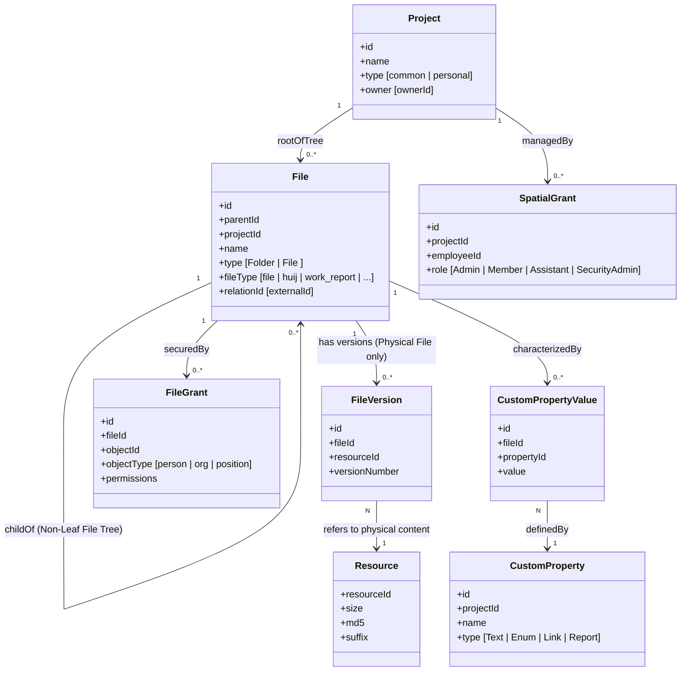

# 知识库本体论 (Ontology) 设计说明文档

## 修订记录

| 版本 | 日期 | 变更摘要 | 变更人 |
|------|------|----------|--------|
| 1.0 | 2026-05-20 | 初版创建，明确核心概念、拓扑关系及 AI-First 规范 | AI 助手 |
| 2.0 | 2026-05-20 | 根据深层设计原理重构：引入非传统叶子节点 File 树、多版本资源重组模型以及个人知识库独立特权 | AI 助手 |
| 3.0 | 2026-05-20 | 根据代码库真实字段修正 `fileType` 字典，对齐物理实体文件与业务引用文件的模型映射 | AI 助手 |
| 4.0 | 2026-05-20 | 结合实际后端代码物理设计，以本体语义为核心、数据库表结构为参考进行精细化迭代 | AI 助手 |

---

## 一、 引言 (Introduction)

在面向 AI 与复杂业务场景的架构设计中，**本体论 (Ontology)** 充当着系统概念的“北极星”。它不仅帮助人类开发者建立一致的认知，更是大语言模型 (LLM) 和 AI Agent 准确进行语义理解、意图推断和 API 工具链规划的核心框架。

本设计说明旨在将 **知识库系统 (Document Database)** 抽象为一套包含**实体 (Classes)、属性 (Properties)、关系 (Relations) 及业务规则 (Rules)** 的形式化系统。文档以高层语义设计为主，同时将后端实际代码的物理结构（Java 类、数据库表）作为**对照参考**，打通高层概念空间与底层代码空间的映射关系。

---

## 二、 核心实体与概念 (Classes / Concepts)

知识库系统的核心概念拓扑结构如下：



### 2.1 空间 (Project)
*   **本体语义**：知识库的最高级隔离单元，代表一个独立的协同工作区。每个空间内部维护一棵独立的 File 树，并且**空间本身拥有独立的授权管理规则**。
*   **概念分类**：
    *   **普通空间**：需显式配置成员全局角色（空间管理员、普通成员等）。
    *   **个人空间（个人知识库）**：专属私密存储盘，默认免配置授权，空间归属人即为最高管理员。
*   **物理落地对照参考**：
    *   Java 实体类：`com.xgjktech.document.data.entity.Project`
    *   物理数据库表：`t_project`
    *   关键识别字段：`personal` (Boolean, 是否个人空间)、`owner` (Long, 个人空间属主)。

### 2.2 文件对象 (File)
*   **本体语义**：目录树结构的**唯一基本组成节点**。每个 `File` 均直接持有自身的授权规则和元数据属性。
*   **非传统树形拓扑**：**File 并非叶子节点**。在知识树中，任意 `File` 节点的下方均可继续拥有子节点（可挂载子文件夹，亦可挂载子文件），实现无限级的知识节点嵌套。
*   **形态与角色细分**：
    *   *文件夹 (Folder)*：仅作为容纳下级 File 节点的逻辑容器。
    *   *物理实体文件*：挂载实际物理资源，其 `fileType` 值为 `file`，支持多版本演进。
    *   *业务引用文件*：引用外部系统的实体（如 AI慧记、工作汇报、AI情报等），自身不管理底层的物理字节流，通过引用指针映射。
*   **物理落地对照参考**：
    *   Java 实体类：`com.xgjktech.document.data.entity.File`
    *   物理数据库表：`t_file`
    *   核心字典及映射：
        *   `type` (Integer): `1` 文件夹；`2` 文件；`3` 库。
        *   `fileType` (String): 枚举字典对应 `file` (物理实体文件)、`work_report` (工作汇报)、`work_plan` (工作任务)、`huij` (AI慧记)、`ai-report` (AI情报)、`notex_result` (NoteX)。
        *   `relationId` (String): 用于存放外部业务实体的 ID。

### 2.3 底层物理资源 (Resource)
*   **本体语义**：由**基础服务**独立管理的、底层的不可变（Immutable）物理字节流资源。
*   **重组管理本质**：`File` 并非物理数据的直接承载体，**它本质上是对底层资源（Resource）在业务层面的虚拟重组管理视图**。因此，底层的单个物理资源可以被跨文件、跨版本地多次映射引用。
*   **物理落地对照参考**： 
    *   物理数据库表[file服务]：`t_resource`

### 2.6 文件版本 (FileVersion)
*   **本体语义**：对于“物理实体文件”形态的 File，其每一次更迭产生的历史状态快照，用于将 File 节点与具体的底层 Resource 进行强绑定。
*   **物理落地对照参考**：
    *   Java 实体类：`com.xgjktech.document.data.entity.FileVersion`
    *   物理数据库表：`t_file_version`

### 2.7 空间授权 (SpatialGrant) 与 文件授权 (FileGrant)
本体将安全控制抽象为**双轨授权系统**：
*   **空间级授权 (SpatialGrant)**：控制用户在空间层面的全局角色。
*   **文件级授权 (FileGrant)**：作用于特定 File 节点的高细粒度授权。
    *   *继承规则*：默认向下穿透继承所有祖先节点以及空间的授权规则。
    *   *打断规则*：允许在任意 File 节点层级开启“阻断继承”，此时该节点及其子分支将脱离上级继承链，以该节点的独立授权规则为准。
*   **物理落地对照参考**：
    *   空间级授权 Java 类：`com.xgjktech.document.data.entity.Grant`（表 `t_grant`），管理角色包括：`0`普通成员, `1`空间管理员, `2`助理, `3`安全管理员。
    *   文件级授权 Java 类：`com.xgjktech.document.data.entity.FileGrant`（表 `t_file_grant`），管理受体类型 `person`（个人）、`org`（部门）及具体权限项 `permissions`。

### 2.8 多维自定义属性 (CustomProperty & CustomPropertyValue)
*   **本体语义**：用户可在空间内为节点配置定义额外的高维度元数据，它由属性字典（元数据描述）与属性绑定值（实例表现）两部分构成。
*   **物理落地对照参考**：
    *   属性定义 Java 类：`com.xgjktech.document.data.entity.FileProperty`（表 `t_file_property`），属性类型包括文本、枚举、链接、工作汇报等。
    *   绑定值 Java 类：`com.xgjktech.document.data.entity.FilePropertyValue`（表 `t_file_property_value`）。

---

## 三、 实体关系描述 (Object Properties / Relations)

本体实体之间的逻辑映射与控制链路定义如下：

### 3.1 树状拓扑关系 (Tree Topology)
*   `File` $\rightarrow$ **childOf** $\rightarrow$ `File`
    *   逻辑：非传统树拓扑，文件不仅能够作为叶子节点，也可以拥有子节点。
    *   物理对照：通过 `parentId` 和 `ancestorIds`（逗号隔开的祖先 ID 串，例如 `"101,102"`) 实现底层的拓扑导航。

### 3.2 虚拟重组关系 (Virtual Materialization)
*   `File` (物理文件) $\rightarrow$ **derivedFrom** $\rightarrow$ `FileVersion` (历史快照) $\rightarrow$ **references** $\rightarrow$ `Resource` (只读物理实体)
    *   映射策略：一个物理 `Resource` (例如上传的物理 PDF 文件) 可以通过 `FileVersion` 被多次复用挂载到不同的 `File` 业务节点下，从而实现零数据冗余下的资源重组。

### 3.3 授权继承与阻断链路 (Security Inheritance & Shielding)
*   `File` $\rightarrow$ **securedBy** $\rightarrow$ `FileGrant`
    *   当 `File.inheritPermission` 的值为 `1`（继承）时：
        `File` 的实际有效权限集 = 自身 `FileGrant` $\cup$ 空间 `SpatialGrant` $\cup$ $\bigcup_{a \in ancestors} a.FileGrant$
    *   当 `File.inheritPermission` 的值为 `2`（不继承/阻断）时：
        `File` 的实际有效权限集 = 自身 `FileGrant`（上级链条的权限集被在此层阻断、剥离）。

---

## 四、 核心业务规则与约束 (Axioms & Constraints)

在对接或基于本体进行系统设计时，必须满足以下公理约束，否则将破坏知识库的拓扑一致性：

*   **规则 1：空间物理隔离**
    $$\forall x (File(x) \rightarrow \exists! y (Project(y) \wedge belongsTo(x, y)))$$
    文件在移动（Move）或复制（Copy）时，一旦跨空间，对应的空间归属 `projectId` 必须进行强制洗牌。

*   **规则 2：物理资源只读与解耦**
    底层的物理资源（Resource）是不包含业务含义的只读实体：
    *   物理资源 `resourceId` 的生命周期与 File 业务逻辑节点的删除是解耦的。删除一个 `File` 节点不会立即引起底层物理存储的抹除。
    *   修改文件时，不得覆写底层的物理资源，必须上传新文件生成 `new_resourceId`，再由 `FileVersion` 进行绑定。

*   **规则 3：附件归档与业务引用分流**
    *   **物理附件模式 (`fileType=file`)**：数据流向必须是 `基础物理上传 -> 换取 resourceId -> 业务 File 节点与资源 ID 绑定`。
    *   **业务引用模式 (以 `huij`, `work_report`, `work_plan`, `ai-report`, `notex_result` 为代表)**：节点不在基础服务层保存物理流，其 `resourceId` 通常为空。内容通过 `relationId` 与外部微服务实体（如 AI慧记系统）的真实数据 ID 进行绑定映射。

---

## 五、 针对 AI Agent 的决策与调用指引 (AI Guidelines)

为大语言模型 (LLM) 在扮演 Agent 调用知识库接口时提供高效率、无混淆的动作参考：

### 5.1 读动作路径决策 (Read Action Paths)
当 AI 需要消费文件正文内容时，决策链如下：
```
                              [需要消费文件内容]
                                      │
                         ┌────────────┴────────────┐
                         ▼                         ▼
                    【UI阅读模式】              【AI提纯消费】
                 (流式分页、段落滚动)      (提取核心正文、拼入提示词)
                         │                         │
            调用: getFileContentV2            调用: getFullFileContentV2
             - 传入 pageNumber 翻页            - 一次性获取提纯 MD 文本
             - 物理 PDF 按页渲染                 (如 RAG 首选)
```

### 5.2 写动作路径决策 (Write Action Paths)
当 AI 需要向知识库写入或归档信息时：
*   **路径 A：归档物理文件（如 PDF/Word/PPTX 物理原件）**
    *   *决策*：使用 `fileType = file` 模式。
    *   *步骤*：大文件秒传预检 $\rightarrow$ 未命中则分片上传 $\rightarrow$ 合并并获取 `resourceId` $\rightarrow$ 创建 File 节点绑定 `resourceId`。
*   **路径 B：创建/绑定外部业务关联（如 AI 慧记等）**
    *   *决策*：使用具体的引用取值（如 `fileType = huij`）。
    *   *步骤*：在调用创建节点的 API 时，直接在请求参数中回填外部业务系统返回的真实数据 ID 至 `relationId`。由于这属于外部系统数据映射，AI 不需要调用底层的文件物理分片上传接口。

### 5.3 个人空间特权与免授权操作
*   对于个人空间（`type=personal`），其所有权人即为最高管理员。在个人空间下同步或创建节点时，AI 应当**避免发起任何授权修改 (FileGrant) 操作**，也无需处理复杂的继承拦截判定，以简化调用链路。
